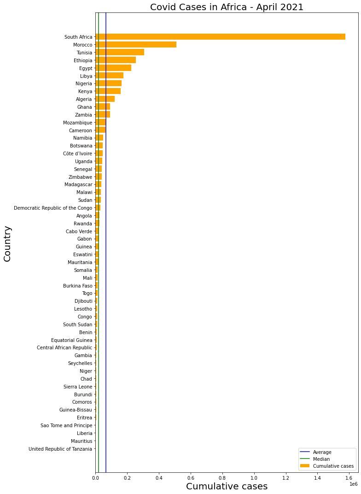

# Introduction

The World Health Organisation (WHO) provides the official daily counts of COVID-19 cases and deaths reported by countries, territories and areas globally. The dataset contains information such as the cases (cumulative total), cases (per 100,000 population), deaths (cumulative total), deaths (per 100,000 population), etc. 

The dataset is available via this link - https://covid19.who.int/table. Caution must be taken when interpreting the data presented as different countries and territories have different data collection techniques and frequencies. 

# Aim and Objectives

The exercise focusses on Africa and analyses the following using the dataset provided by the WHO:

* Rank the Covid-19 cases in Africa (i.e. most cases to least cases, top (3) and bottom (3) African countries)
* Distribution of cases (per 100,000 population) for each African country 
* Visualise the data using bar charts and interactive maps 
* Evaluate some descriptive statistics (e.g. Mean, Median)
* Utilise pandas, matplotlib and plotly libraries for data analysis and visualisation 

# We will use pandas, matplotlib and plotly libraries for this exercise

* We'll use Pandas for data manipulation and analysis, e.g. open csv files, sort and filter data. 
* We'll use matplotlib.pyplot for data visualisation (i.e. bar charts)
* We'll use plotly for interactive choropleth maps

# Data Preparation and Analysis

Let's import pandas for data manipulation and analysis

```python
import pandas as pd  
```

Now lets read this csv data from the WHO dataset to a Pandas dataframe

```python
df = pd.read_csv("https://covid19.who.int/WHO-COVID-19-global-table-data.csv")
```

Let's take a look at the dataset. 

```
df
```

|     | Name                     | WHO Region      | Cases - cumulative total | Cases - cumulative total per 100000 population | Cases - newly reported in last 7 days | Cases - newly reported in last 7 days per 100000 population | Cases - newly reported in last 24 hours | Deaths - cumulative total | Deaths - cumulative total per 100000 population | Deaths - newly reported in last 7 days | Deaths - newly reported in last 7 days per 100000 population | Deaths - newly reported in last 24 hours | Transmission Classification |
| --- | ------------------------ | --------------- | ------------------------ | ---------------------------------------------- | ------------------------------------- | ----------------------------------------------------------- | --------------------------------------- | ------------------------- | ----------------------------------------------- | -------------------------------------- | ------------------------------------------------------------ | ---------------------------------------- | --------------------------- |
| 0   | Global                   | NaN             | 148999876                | 1908.710561                                    | 5793002                               | 74.209217                                                   | 856330                                  | 3140115                   | 40.22534                                        | 92170                                  | 1.180711                                                     | 15185                                    | NaN                         |
| 1   | United States of America | Americas        | 31835314                 | 9617.840000                                    | 367742                                | 111.100000                                                  | 51939                                   | 567971                    | 171.59000                                       | 4747                                   | 1.430000                                                     | 644                                      | Community transmission      |
| 2   | India                    | South-East Asia | 18376524                 | 1331.630000                                    | 2445559                               | 177.210000                                                  | 379257                                  | 204832                    | 14.84000                                        | 20175                                  | 1.460000                                                     | 3645                                     | Clusters of cases           |
| 3   | Brazil                   | Americas        | 14441563                 | 6794.130000                                    | 398487                                | 187.470000                                                  | 72140                                   | 395022                    | 185.84000                                       | 17019                                  | 8.010000                                                     | 3086                                     | Community transmission      |
| 4   | France                   | Europe          | 5447883                  | 8376.290000                                    | 190837                                | 293.420000                                                  | 29980                                   | 102890                    | 158.20000                                       | 1973                                   | 3.030000                                                     | 315                                      | Community transmission      |
| ... | ...                      | ...             | ...                      | ...                                            | ...                                   | ...                                                         | ...                                     | ...                       | ...                                             | ...                                    | ...                                                          | ...                                      | ...                         |
| 233 | Saint Helena             | Africa          | 0                        | 0.000000                                       | 0                                     | 0.000000                                                    | 0                                       | 0                         | 0.00000                                         | 0                                      | 0.000000                                                     | 0                                        | No cases                    |
| 234 | Tokelau                  | Western Pacific | 0                        | 0.000000                                       | 0                                     | 0.000000                                                    | 0                                       | 0                         | 0.00000                                         | 0                                      | 0.000000                                                     | 0                                        | No cases                    |
| 235 | Tonga                    | Western Pacific | 0                        | 0.000000                                       | 0                                     | 0.000000                                                    | 0                                       | 0                         | 0.00000                                         | 0                                      | 0.000000                                                     | 0                                        | No cases                    |
| 236 | Turkmenistan             | Europe          | 0                        | 0.000000                                       | 0                                     | 0.000000                                                    | 0                                       | 0                         | 0.00000                                         | 0                                      | 0.000000                                                     | 0                                        | No cases                    |
| 237 | Tuvalu                   | Western Pacific | 0                        | 0.000000                                       | 0                                     | 0.000000                                                    | 0                                       | 0                         | 0.00000                                         | 0                                      | 0.000000                                                     | 0                                        | No cases                    |

238 rows × 13 columns

For this exercise, we'll only need the numerical data from two columns: "Cases - cumulative total" and "Cases - cumulative total per 100000 population".

```ipynb
df = pd.DataFrame(df, columns=["Name",
                               "WHO Region",
                               "Cases - cumulative total", 
                               "Cases - cumulative total per 100000 population"])
```

Now, let's take a look at the updated dataset. 

```
df
```

<!--StartFragment-->

| Name | WHO Region               | Cases - cumulative total | Cases - cumulative total per 100000 population |             |
| ---- | ------------------------ | ------------------------ | ---------------------------------------------- | ----------- |
| 0    | Global                   | NaN                      | 148999876                                      | 1908.710561 |
| 1    | United States of America | Americas                 | 31835314                                       | 9617.840000 |
| 2    | India                    | South-East Asia          | 18376524                                       | 1331.630000 |
| 3    | Brazil                   | Americas                 | 14441563                                       | 6794.130000 |
| 4    | France                   | Europe                   | 5447883                                        | 8376.290000 |
| ...  | ...                      | ...                      | ...                                            | ...         |
| 233  | Saint Helena             | Africa                   | 0                                              | 0.000000    |
| 234  | Tokelau                  | Western Pacific          | 0                                              | 0.000000    |
| 235  | Tonga                    | Western Pacific          | 0                                              | 0.000000    |
| 236  | Turkmenistan             | Europe                   | 0                                              | 0.000000    |
| 237  | Tuvalu                   | Western Pacific          | 0                                              | 0.000000    |

238 rows × 4 columns

<!--EndFragment-->

As we can see, the WHO dataset contains data for different countries and regions in the world.

For this exercise, we are only interested in the data for countries within Africa. 

# Filtering Africa-Specific Covid-19 Dataset

We can assign a variable (Africa) to a filtered dataframe showing only countries with "Africa" assigned as the WHO region. 

```
Africa = df[df["WHO Region"]=="Africa"]
```

Now, let's take a look at the new filtered data using the "head" function, which shows the top 5 entries in the dataframe

```
Africa.head()
```

<!--StartFragment-->

| Name | WHO Region   | Cases - cumulative total | Cases - cumulative total per 100000 population |         |
| ---- | ------------ | ------------------------ | ---------------------------------------------- | ------- |
| 20   | South Africa | Africa                   | 1577200                                        | 2659.31 |
| 61   | Ethiopia     | Africa                   | 254044                                         | 220.98  |
| 79   | Nigeria      | Africa                   | 164912                                         | 80.00   |
| 80   | Kenya        | Africa                   | 157492                                         | 292.89  |
| 86   | Algeria      | Africa                   | 121344                                         | 276.72  |

<!--EndFragment-->

Let's count the number of entries in the filtered dataset (Africa)

```
len(Africa)
```

50

The initial filtered data (Africa) only shows 50 countries, however, there are 54 countries in Africa (https://www.worldometers.info/geography/how-many-countries-in-africa/).

This is because some Africa countries (i.e. Morocco, Tunisia, Egypt, Sudan, Libya, Somalia and Djibouti) are classified under the "Eastern Mediterranean" WHO Region.

Also, "Réunion", "Mayotte" & "Saint Helena" (which are dependent territories) are classified within Africa.

Therefore, for this exercise, these dependent territories are excluded.

We'll create a new variable (Africa_updated) to include & exclude the aforementioned countries.

```
Africa_updated = df[(df["WHO Region"]=="Africa" ) & 
                 ~df["Name"].isin(["Réunion", "Mayotte", "Saint Helena"]) |
                 df["Name"].isin(["Morocco", "Tunisia", "Egypt", "Sudan", "Libya", "Somalia", "Djibouti"]) 
                  ]
```

Again, Let's count the number of entries in the updated dataset (Africa_updated)

```
len(Africa_updated)
```

54

54 matches the total number of countries in Africa - https://www.worldometers.info/geography/how-many-countries-in-africa/

# Descriptive Statistics

In order to get some descriptive statistics (e.g. mean, median, minimum, maximum) for the data, we'll  use the "describe" function shown below

```
Africa_updated.describe()
```

<!--StartFragment-->

| Cases - cumulative total | Cases - cumulative total per 100000 population |             |
| ------------------------ | ---------------------------------------------- | ----------- |
| count                    | 5.400000e+01                                   | 54.000000   |
| mean                     | 8.383431e+04                                   | 647.380000  |
| std                      | 2.266335e+05                                   | 1084.383573 |
| min                      | 5.090000e+02                                   | 0.850000    |
| 25%                      | 6.659000e+03                                   | 88.475000   |
| 50%                      | 2.230700e+04                                   | 206.945000  |
| 75%                      | 4.765825e+04                                   | 499.902500  |
| max                      | 1.577200e+06                                   | 5513.130000 |

<!--EndFragment-->

# Cumulative Covid19 Cases in Africa: Top Three (3) and Bottom Three (3) Countries

Let's see what the updated data looks like. We'll like to see the top three (3) and bottom three (3) lines of the updated dataset

```
Africa_updated.head(3)
```

<!--StartFragment-->

| Name | WHO Region   | Cases - cumulative total | Cases - cumulative total per 100000 population |         |
| ---- | ------------ | ------------------------ | ---------------------------------------------- | ------- |
| 20   | South Africa | Africa                   | 1577200                                        | 2659.31 |
| 41   | Morocco      | Eastern Mediterranean    | 510465                                         | 1382.98 |
| 56   | Tunisia      | Eastern Mediterranean    | 305313                                         | 2583.32 |

<!--EndFragment-->

```
Africa_updated.tail(3)
```

<!--StartFragment-->

| Name | WHO Region                  | Cases - cumulative total | Cases - cumulative total per 100000 population |       |
| ---- | --------------------------- | ------------------------ | ---------------------------------------------- | ----- |
| 188  | Liberia                     | Africa                   | 2098                                           | 41.48 |
| 194  | Mauritius                   | Africa                   | 1206                                           | 94.83 |
| 202  | United Republic of Tanzania | Africa                   | 509                                            | 0.85  |

<!--EndFragment-->

# Cumulative Covid19 Cases per 100,000 Population in Africa: Top Three (3) and Bottom Three (3) Countries

Now, let's sort the dataset by the cumulative total cases per 100,000 population and assign it to a new variable

```
Africa_Sort = Africa_updated.sort_values(by="Cases - cumulative total per 100000 population", ascending=False)
```

Let's see what the sorted data (Africa_Sort) looks like. We'll also like to see the top three (3) and bottom three (3) lines of the sorted dataset

```
Africa_Sort.head(3)
```

<!--StartFragment-->

| Name | WHO Region   | Cases - cumulative total | Cases - cumulative total per 100000 population |         |
| ---- | ------------ | ------------------------ | ---------------------------------------------- | ------- |
| 165  | Seychelles   | Africa                   | 5422                                           | 5513.13 |
| 125  | Cabo Verde   | Africa                   | 22772                                          | 4095.78 |
| 20   | South Africa | Africa                   | 1577200                                        | 2659.31 |

<!--EndFragment-->

```
Africa_Sort.tail(3)
```

<!--StartFragment-->

|     | Name                        | WHO Region | Cases - cumulative total | Cases - cumulative total per 100000 population |
| --- | --------------------------- | ---------- | ------------------------ | ---------------------------------------------- |
| 168 | Chad                        | Africa     | 4779                     | 29.09                                          |
| 166 | Niger                       | Africa     | 5204                     | 21.50                                          |
| 202 | United Republic of Tanzania | Africa     | 509                      | 0.85                                           |

<!--EndFragment-->

# Data Visualisation - What is the cumulative number of cases for each African Country

First, we'll use matplotlib to plot a horizontal bar chart to visualise the cumulative number of cases for each African Country.

```
import matplotlib.pyplot as plt 
```

Let's assign variables to the data corresponding to the vertical and horizontal axes in the bar chart

```
Country = Africa_updated["Name"] #this will be on the vertical axis
Cumulative_cases = Africa_updated["Cases - cumulative total"] #this will be on the horizontal axis
```

Let's visualise the data (horizontal bar chart) and compare the cumulative number of cases for each African Country 

```
#Basic horizontal bar chart to visualise the cumulative number of cases for each African Country

fig, ax = plt.subplots(figsize=(11,15))
ax.barh(Country, Cumulative_cases, color = "Orange", label = "Cumulative cases")
ax.set_title("Covid Cases in Africa - April 2021", fontsize = 20)
ax.set_xlabel("Cumulative cases", fontsize = 20)
ax.set_ylabel("Country", fontsize = 20)
ax.invert_yaxis() 

#"iat" is used to pickup a particular cell
plt.axvline(Africa.describe().iat[1,0], color = "blue", label = "Average") #Average vertical line 
plt.axvline(Africa.describe().iat[5,0], color = "green", label = "Median") #Median vertical line 
plt.tight_layout()
plt.legend();
```



# Let's visualise the cumulative number of cases for each African Country on a Choropleth map

Plotly is used for the analysis because it allows interactive features and the choice of a Choropleth map

```ipynb
import plotly.express as px 

#Interactive African map to visualise the cumulative number of cases for each African Country

Cumulative_cases_plot = px.choropleth(Africa_updated,
                    locations="Name", #Spatial coordinates and corrseponds to a column in dataframe
                    color="Cases - cumulative total", #Corresponding data in the dataframe
                    locationmode = 'country names', #location mode == One of ‘ISO-3’, ‘USA-states’, or ‘country names’ 
                    #locationmode == should match the type of data entries in "locations"
                    scope="africa", #limits the scope of the map to Africa
                    title ="Covid-19 Cases in Africa - April 2021 (Cases - cumulative total)",
                    hover_name="Name",
                    color_continuous_scale = "deep",
                   )
Cumulative_cases_plot.update_traces(marker_line_color="black") # line markers between states
Cumulative_cases_plot.show()
```

<iframe width="900" height="800" frameborder="0" scrolling="no" src="//plotly.com/~bunmiadeayo/1.embed"></iframe>

### This is an interactive map, so you can hover over each region, zoom in and out of the map.

# What is the cumulative number of cases per  100,000 population for each African Country

Let's assign variables to the data corresponding to the vertical and horizontal axes in the new bar chart

```
Country_Sort = Africa_Sort["Name"]
Cumulative_cases_per_population = Africa_Sort["Cases - cumulative total per 100000 population"]
```

To put things in perspective, we need to evaluate the cumulative number of cases per 100,000 population for each African Country (i.e. the number of cases as a fraction of the population).