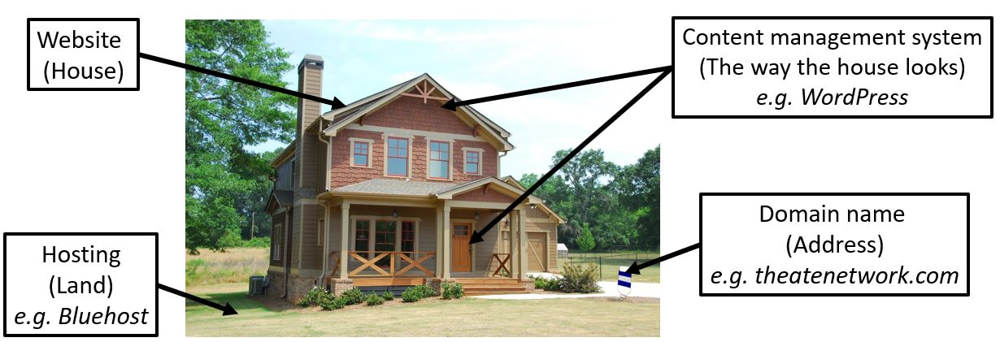
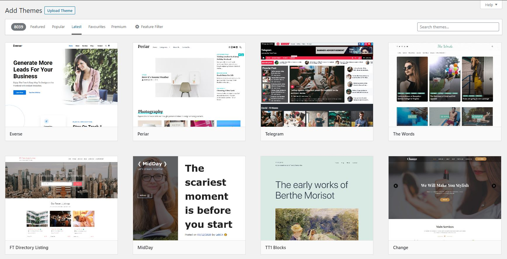

**Disclosure**: This website contains affiliate links, and if you make a purchase through them, I will be compensated at zero additional cost to you. This helps support the work on this platform. Nevertheless, I only suggest products or services that I use and would recommend.

Would you like to build a website for your brand, business, product, service or create a personalised online portfolio? If Yes, then you’re on the right blog post. Some people are terrified or intimidated about the website design process; however, this blog post aims to **simplify and guide you step-by-step** on setting up and building a website for your brand, business, product, service using [Bluehost](http://www.bluehost.com/track/drsotayo). 

This post also shows that you don’t need a professional website developer to design a website. There are many platforms (e.g., [Bluehost](http://www.bluehost.com/track/drsotayo), Wix, Squarespace) that have made the website design process very user-friendly. 

Before we get started, check out some benefits of building a website for your brand/business:

* It provides more information about yourself and services (e.g., what you offer).
* You will look more professional.
* It improves your online visibility, for example, see the Google search image below.

\-

# Let’s get started

Firstly, it’s important to understand some key concepts before getting started. For example, if we were to compare the process of developing a website, with that of building a house, it’ll be as follows:

* **Website** – The **house/location** for your brand/business on the internet.

* **Hosting platform** – This is the **land** for building the house. Examples of hosting platforms include [Bluehost](http://www.bluehost.com/track/drsotayo), Wix, Squarespace etc.

* **Domain name** – This is the **house address**. For example, theatenetwork.com, drsotayo.com, abbasegbeyemi.me, etc.

* **Content management system** – This is for managing the content and styling the house. For example, WordPress.

The image below also describes the analogy.

\-

\-

In the context of this guide, it is worth noting that WordPress is integrated with [Bluehost](http://www.bluehost.com/track/drsotayo) which simplifies the process of hosting your website alongside managing the files and content for your website. In addition, [Bluehost/WordPress](http://www.bluehost.com/track/drsotayo) has a lot of resources (partly due to their popularity), reliable service, excellent customer service and reviews, and is reasonably user-friendly for beginners.

# **Here’s a Step-by-Step Guide:**

1. Go to [Bluehost ](http://www.bluehost.com/track/drsotayo)and click the **Get Started** button.

\-

\-

2. Select the hosting plan (i.e., [Bluehost pricing)](http://www.bluehost.com/track/drsotayo) that you need. The **BASIC plan** under the **36 months** tab is an excellent option for beginners. 

\-

\-

3. Choose a **domain** for your website. Ensure your domain name aligns with your brand or vision (quick tips – ensure that it’s easy to remember, easy to spell and reasonably short). 

\-

\-

4. You will then be asked to enter your **Account Information, Package Information**, select **Package Extras** and enter **Payment Information**. As part of the Package Extras, select **Domain Privacy + Protection** (This ensures that the public can’t find your personal details, e.g., phone number or email address).

\-

\-

5. Once the process is completed, install, and log in to WordPress (WordPress is integrated into [Bluehost](http://www.bluehost.com/track/drsotayo), so it’s reasonably straightforward). Now, the **domain, hosting** and **content management system** are secured (Well done!). 

Now, you can style your website by selecting your appropriate theme (i.e., website layout). 

To select a **Theme**, go to **Appearance** > **Themes**. You can search for themes with the relevant keywords for your brand/business (if needed, you can change the theme at a later stage). 

\-

\-

6. You can now create website pages by going to **Pages > Add New.**  

This can include: 

* **Home Page**
* **About Page**
* **Products or Services Page (if applicable)**
* **Blog Page**
* **Contact Page** 

\-

\-

7. To write your first blog post, go to **Posts > Add New**.

\-

\-

8. To include images, videos and PDFs, go to **Media > Add New**.  Use high-quality images of your products. Alternatively, there are platforms that offer free high-quality images such as [Pixabay](https://pixabay.com/), [Unsplash ](https://unsplash.com/)and [Pexels](https://www.pexels.com/).

\-

\-

9. You can edit the details of your current theme by using the **Customize** function, go to **Appearance > Customize**. 

\-

\-

# Congratulations!

You can now share your wonderful website with the world!

I hope this blog post has shown that building a website for your brand/business using [Bluehost](http://www.bluehost.com/track/drsotayo) is not terrifying and can be developed within minutes. At first, it may not be perfect (also, website design can be very subjective) and may take a few changes to get it where you want it. However, in the words of Mark Zuckerberg (Founder of Facebook),

> “Ideas don’t come out fully formed. They only become clear as you work on them. You just have to get started.”
>
>

Therefore, you can apply this principle to showcase your excellent work with the world and get started now! Good luck!

Written by Dr Adeayo Sotayo

Connect: [LinkedIn](https://www.linkedin.com/in/adeayosotayo)           [Personal Website](https://www.drsotayo.com/)